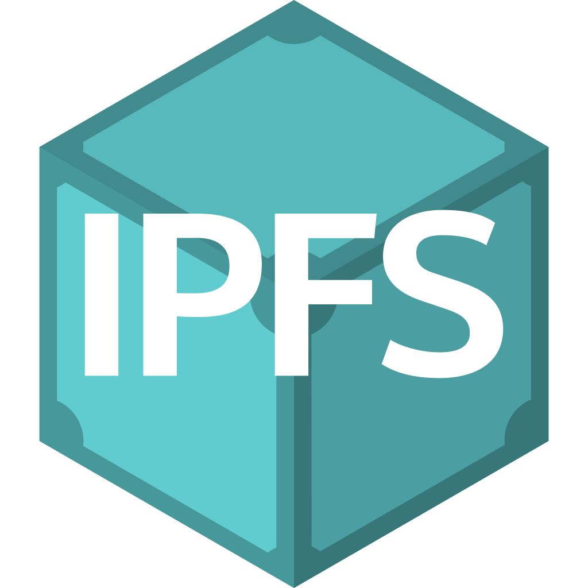
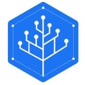

👋 UNDER CONSTRUCTION 🤔

#### Websites

<table boder=0>
<tr>
    <td></td>
    <td><a href="https://protocol.ai">Protocol Labs</a></td>
</tr>
<tr>
    <td></td>
    <td><a href="https://proto.school">ProtoSchool</a></td>
</tr>
</table>

#### Tutorials, White Papers, and Articles

- [The Decentralized Web Primer](https://dweb-primer.ipfs.io)
- [IPFS - Content Addressed, Versioned, P2P File System](https://ipfs.io/ipfs/QmR7GSQM93Cx5eAg6a6yRzNde1FQv7uL6X1o4k7zrJa3LX/ipfs.draft3.pdf)
- [Understanding the IPFS White Paper](https://decentralized.blog/understanding-the-ipfs-white-paper-part-1.html)
- [IPFS Introduction by Example](http://whatdoesthequantsay.com/2015/09/13/ipfs-introduction-by-example)
- [INFURA Tutorial: Introduction to IPFS](https://github.com/INFURA/tutorials/wiki/Introduction-to-IPFS)
- [Tutorial: Setting up an IPFS peer, part I](https://medium.com/textileio/tutorial-setting-up-an-ipfs-peer-part-i-de48239d82e0)
- [Swapping bits and distributing hashes on the decentralized web](https://medium.com/textileio/swapping-bits-and-distributing-hashes-on-the-decentralized-web-5da98a3507)

#### Development

<table boder=0>
<tr>
<th>Projects</th><th>Specifications</th><th>Golang</th><th>JavaScript</th><th>Rust</th>
</tr>
<tr align="center">
    <td><a href="https://github.com/ipfs">IPFS</a>
    </td>
    <td>
    </td>
    <td>
    </td>
    <td>
    </td>
    <td>
    </td>
</tr>
<tr align="center">
    <td><a href="https://github.com/filecoin-project">Filecoin</a>
    </td>
    <td>
    </td>
    <td>
    </td>
    <td>
    </td>
    <td>
    </td>
</tr>
<tr align="center">
    <td><a href="https://github.com/libp2p">libp2p</a>
    </td>
    <td>
    </td>
    <td>
    </td>
    <td>
    </td>
    <td>
    </td>
</tr>
<tr align="center">
    <td><a href="https://github.com/ipld">IPLD</a>
    </td>
    <td>
    </td>
    <td>
    </td>
    <td>
    </td>
    <td>
    </td>
</tr>
<tr align="center">
    <td><a href="https://github.com/multiformats">Multiformats</a>
    </td>
    <td>
    </td>
    <td>
    </td>
    <td>
    </td>
    <td>
    </td>
</tr>
</table>

#### Forums

<table boder=0>
<tr>
    <td></td>
    <td><a href="https://discuss.ipfs.io/">IPFS</a></td>
</tr>
<tr>
    <td></td>
    <td><a href="https://discuss.filecoin.io/">Filecoin</a></td>
</tr>
<tr>
    <td></td>
    <td><a href="https://discuss.libp2p.io/">libp2p</a></td>
</tr>
</table>

#### Chats

<table boder=0>
<tr>
    <td></td>
    <td><a href="https://discuss.ipfs.io/">IPFS</a></td>
</tr>
<tr>
    <td></td>
    <td><a href="https://webchat.freenode.net/?channels=%23filecoin">Filecoin</a></td>
</tr>
<tr>
    <td></td>
    <td><a href="https://webchat.freenode.net/?channels=%23libp2p">libp2p</a></td>
</tr>
</table>

