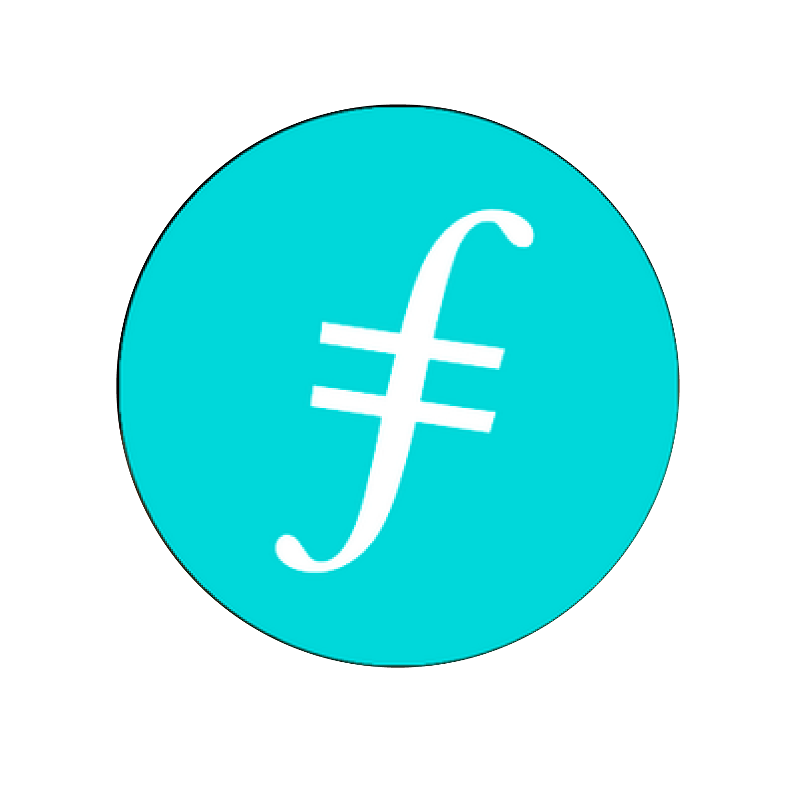
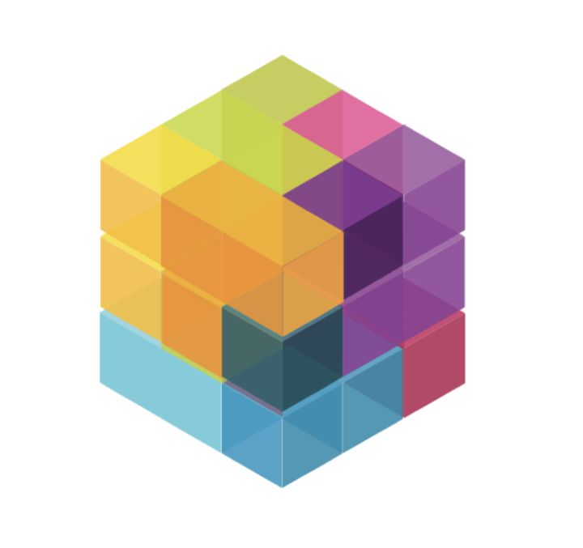

### Protocol Labs

##### Websites

<table boder=0>
<tr>
    <td></td>
    <td><a href="https://protocol.ai">Protocol Labs</a></td>
</tr>
<tr>
    <td></td>
    <td><a href="https://proto.school">ProtoSchool</a></td>
</tr>
</table>

[Protocol Labs](https://protocol.ai/)

[ProtoSchool - Interactive tutorials on decentralized web protocols](https://proto.school/#/)

##### Forums

<table boder=0>
<tr>
    <td></td>
    <td><a href="https://discuss.ipfs.io/">discuss ipfs</a></td>
</tr>
<tr>
    <td></td>
    <td><a href="https://discuss.filecoin.io/">discuss filecoin</a></td>
</tr>
<tr>
    <td></td>
    <td><a href="https://discuss.libp2p.io/">discuss libp2p</a></td>
</tr>
</table>

### IPFS related links

