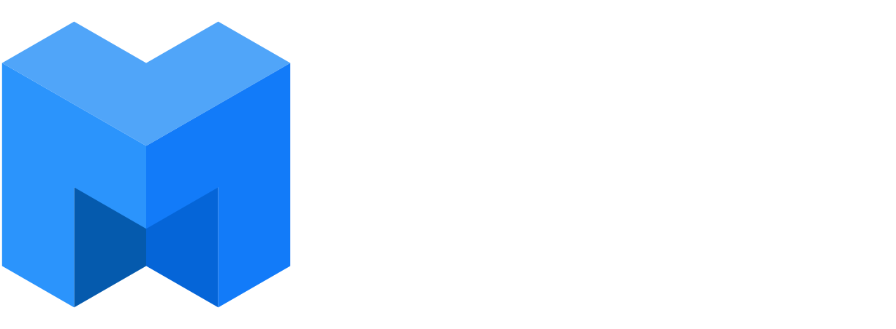

#### Websites

<table boder=0>
<tr>
    <td></td>
    <td><a href="https://protocol.ai">Protocol Labs</a></td>
</tr>
<tr>
    <td></td>
    <td><a href="https://proto.school">ProtoSchool</a></td>
</tr>
</table>

#### Forums

<table boder=0>
<tr>
    <td></td>
    <td><a href="https://discuss.ipfs.io/">IPFS</a></td>
</tr>
<tr>
    <td></td>
    <td><a href="https://discuss.filecoin.io/">Filecoin</a></td>
</tr>
<tr>
    <td></td>
    <td><a href="https://discuss.libp2p.io/">libp2p</a></td>
</tr>
</table>

#### Development

<table boder=0 align="center">
<tr>
<th>Projects</th><th>Specifications</th><th>Golang</th>
</tr>
<tr align="center">
    <td><a href="https://github.com/ipfs">IPFS</a>
    </td>
    <td>
    </td>
    <td>
    </td>
</tr>
<tr align="center">
    <td><a href="https://github.com/filecoin-project">Filecoin</a>
    </td>
    <td>
    </td>
    <td>
    </td>
</tr>
<tr align="center">
    <td><a href="https://github.com/libp2p">libp2p</a>
    </td>
    <td>
    </td>
    <td>
    </td>
</tr>
<tr align="center">
    <td><a href="https://github.com/ipld">IPLD</a>
    </td>
    <td>
    </td>
    <td>
    </td>
</tr>
<tr align="center">
    <td><a href="https://github.com/multiformats">Multiformats</a>
    </td>
    <td>
    </td>
    <td>
    </td>
</tr>
</table>

