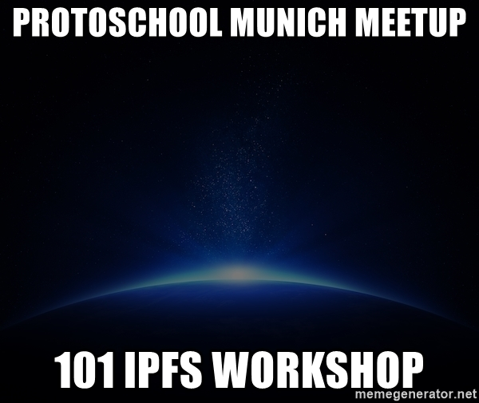
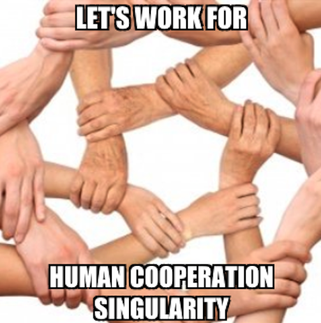
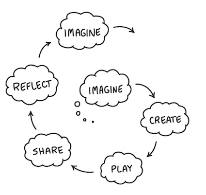

# ProtoSchool Munich

Welcome to the Munich chapter of [ProtoSchool](https://proto.school)!

We are a group of people passionate about the decentralized web and excited to learn, teach, and share ideas. Everyone is welcome!

---
<h1 align="center">🙌 🙌 🙌 Meetup #1 🙌 🙌 🙌</h1>

    
  
    

We announce our first [Protoschool Munich Meetup](https://www.meetup.com/de-DE/Munich-IPFS-User-Group/events/).
See the agenda and more [here](./01_Meetup_101_IPFS_Workshop/README.md).

---

    
  
    

You probably have heard about [Technical Singularity](https://en.wikipedia.org/wiki/Technological_singularity "Wikipedia Article about Technological Singularity")? 
It is the inspiration to this meme. At first glance it tells about the cooperation of humans, at least to me. 
In reality, it speaks, maybe even more, about a human kind of cooperation with technology and via technology.

Quite some disruptive paradigms and technology had shown up the last years followed by ideas what we could do with it.

I one sentence you could say:

_"We are going to overcome the client-server paradigm by having the internet as the server, and this gives us the 
chance to help cooperation to dominate over manipulation."_ 

Still, it's early in the game regarding this ongoing technical revolution. It is the time for the creative ones. 
So, no limits to your ideas. Be curious and think big.

---

## How to start

- start reading the tutorials of [ProtoSchool](https://proto.school)
- become a member of our [meet-up group](https://www.meetup.com/de-DE/Munich-IPFS-User-Group/)
- discuss about your issue on [the IPFS forum](https://discuss.ipfs.io/t/protoschool-munich/4777)

---

BTW: We like [creative learning](https://learn.media.mit.edu/lcl/) like we used to do in the kindergarden 👶

    
  
    

- **Imagine**, get an idea of what you want to do, and bring your ideas into the community. If it's the idea for a 
program or an app, a topic you want to learn and understand, or something totally different.

- **Create** prototypes, tutorials, or white papers.

- **Play**, alone or in groups, online or offline. Attend workshops or organize one yourself. Take part at hackathons 
or other challenges.

- **Share** what you achieved, give talks about it or write down your experience.

- **Reflect**, discuss, think about it again with the gained experience.

## Organizers

Our chapter's leadership team includes:
* Stefan Hans ([@stefanhans](https://github.com/stefanhans))
* Rüdiger Klaehn ([@rklaehn](https://github.com/rklaehn))

## Code of Conduct

In the interest of fostering an open and welcoming environment, we as
contributors and maintainers pledge to making participation in our project and
our community a harassment-free experience for everyone.

By participating in this project (online and at live chapter events) you agree to abide by its [Code of Conduct](./CODE_OF_CONDUCT.md).

## License

ProtoSchool is licensed under the Apache-2.0 and MIT licenses. See [LICENSE.md](https://github.com/protoschool/seattle/blob/master/LICENSE.md) for further detail.
